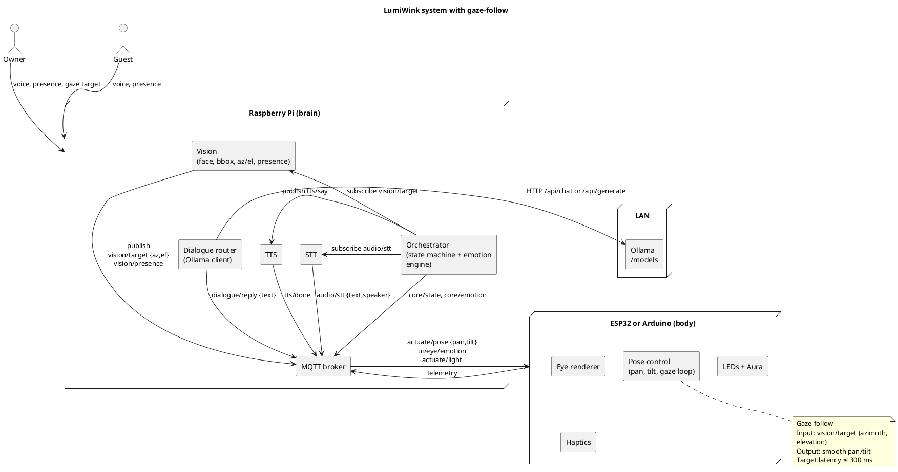

# Architecture: LumiWink

## Physical and electronics
- 3D printed head with round eye window, mic grill, camera slot
- Pan and tilt servos on a small bracket (gimbal)
- LED ring or light pipe for attention cues
- Raspberry Pi as hub (brain)
- Arduino Nano or ESP32 as actuation node (body)

---

## Logical modules on the Pi
- **vad_wake**: VAD and wake word detection
- **stt**: speech-to-text (Vosk on Pi, Whisper offload optional)
- **tts**: Piper TTS
- **vision**: face detection, presence, affect scoring, **gaze-follow target (azimuth/elevation)**
- **ui_eye**: eye animations, state driven
- **orchestrator**: state machine + emotion engine
- **mqtt bus**: Mosquitto for event transport
- **dialogue router**: forwards queries to Ollama, publishes replies

---

## Ollama backend
- Runs locally or on LAN host (e.g. `odin:11434`)
- REST API (`/api/chat` or `/api/generate`)
- Configurable models (`gemma:2b-instruct`, `phi4`, `llama3.1:8b`, etc.)
- Dialogue router sends user text, receives response, then triggers TTS

---

## Body (ESP32/Arduino)
- Drives servos, LEDs, eye display, and haptics
- Executes **pan/tilt gaze-follow commands** in real-time
- Subscribes to MQTT topics (`actuate/pose`, `ui/eye/emotion`, `actuate/light`)
- Handles smooth motion and LED timing loops

---

## Data flow
1. Audio in → vad_wake → stt → dialogue router
2. Dialogue router → Ollama → reply text → tts
3. Vision → orchestrator (presence, affect, gaze az/el)
4. Orchestrator → MQTT → ESP32/Arduino (servos, LEDs, display, haptics)
5. State machine ensures coherent transitions (idle, attend, listen, think, speak, reflect, sleep)
6. **Gaze-follow**: vision publishes az/el target → orchestrator → MQTT → servo pan/tilt

---

## MQTT Topics
- `audio/awake` — wake word detected
- `audio/stt` — text transcript, speaker ID
- `dialogue/query` — request to Ollama
- `dialogue/reply` — Ollama’s response
- `tts/say` — send text to TTS
- `tts/done` — audio finished
- `vision/presence` — count + identities
- `vision/target` — azimuth + elevation of face target
- `core/state` — current state
- `core/emotion` — current emotion overlay
- `actuate/pose` — servo targets
- `actuate/light` — LED mode

---

## Privacy and policy
- Clear recording light during mic activity
- Guest mode disables identity tracking
- Memory wipe command available
- Ollama backend runs locally — no cloud required

---

## Extensibility
- Replace Vosk with Whisper for higher accuracy
- Swap Ollama models depending on hardware and context
- Add diarization and speaker embeddings
- Add multiple ESP32 “satellite eyes” publishing presence back to Pi

---

## System diagram (PlantUML)


---

## Gaze-follow sequence (PlantUML)

```plantuml
@startuml
title Gaze-follow timing ≤ 300 ms

skinparam shadowing false
skinparam defaultFontName Monospace

actor Owner
participant Camera as CAM
participant "Vision\n(Pi)" as VIS
participant "MQTT" as MQ
participant "Pose\n(ESP32/Arduino)" as MCU
participant "Servos" as SRV

Owner -> CAM : face in frame
CAM -> VIS : frame (t=0 ms)
VIS -> VIS : detect face, compute az, el (≈40–80 ms)
VIS -> MQ : publish vision/target {az, el} (≈5 ms)
MQ -> MCU : deliver message (≈5–20 ms LAN/local)
MCU -> MCU : smooth filter + PID (≈5–10 ms)
MCU -> SRV : PWM update (immediate)
SRV -> Owner : head turns, eye aligns (≈100–150 ms motion)

note right of MCU
  Low-pass filter
  clamp speed, accel
  small overshoot allowed
end note

== Budget ==
Detect + publish ≤ 100 ms
Transport + plan ≤ 30 ms
Motion onset ≤ 50 ms
Visible alignment ≤ 120 ms
Total ≤ 300 ms
@enduml
```

