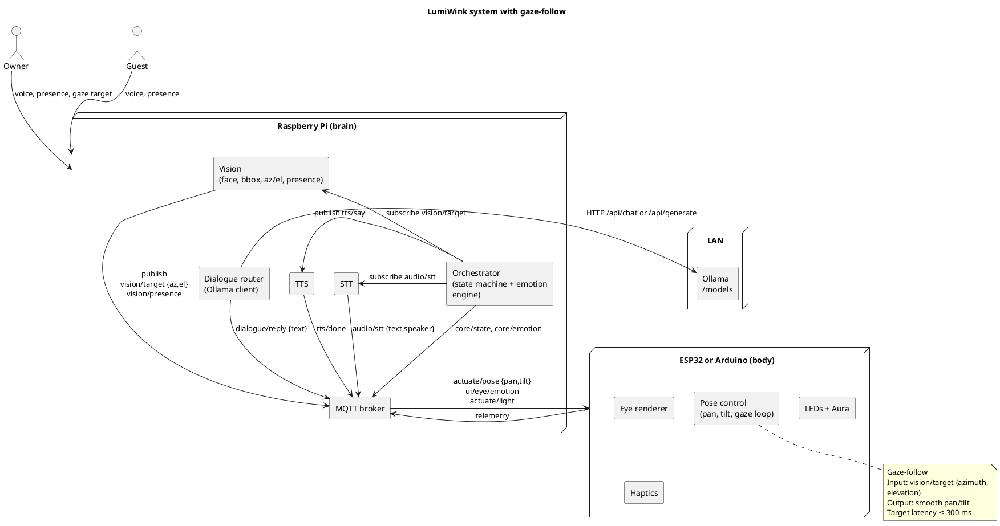

# LumiWink: A Minimal, Expressive AI Presence

## Concept
LumiWink is a **personal AI assistant with a body** — a small robotic interface that simulates attention, emotion, and companionship through minimal hardware.
Instead of being just a disembodied voice, LumiWink *looks at you, reacts to you, and makes communication fun and clear*.

It uses **Ollama** as its dialogue brain, ensuring privacy, local execution, and easy upgrades to stronger models.

---

## Essence
- **Presence**: A simple eye-like form, always visible, giving the sense that someone is “there.”
- **Attention**: Turns toward the speaker, acknowledges gaze, recognizes when others join.
- **Expression**: Eye animations, eyebrow LEDs, aura light, servo tilts, and subtle vibrations simulate emotions that reduce ambiguity and add playfulness.
- **Rituals**: Morning greetings, focus guarding, midday check-ins, and evening closure create continuity and rhythm.
- **Privacy**: On-device by default, clear cues when recording, Ollama backend running on your own hardware.
- **Modularity**: Raspberry Pi as the “brain,” ESP32/Arduino as the “body,” with each part swappable and extensible.
- **Gaze-follow**: Vision detects the counterpart’s location, and LumiWink turns to *look at them*.

---

## Architecture in Brief
- **Pi (Brain)**
  Runs STT, TTS, vision (face/presence detection, gaze-follow), and the orchestrator. Hosts the MQTT event bus. Connects to **Ollama** via HTTP for dialogue.

- **ESP32/Arduino (Body)**
  Handles servos, LEDs, and display refresh with real-time precision. Executes pan/tilt gaze-follow commands.

- **Ollama (Backend AI)**
  Local or LAN instance running models like `gemma:2b-instruct`, `phi4`, `llama3.1:8b`. Provides chat or generate endpoints for replies.

- **State Machine**
  Core behavioral states (idle, attend, listen, think, speak, reflect, sleep). Overlays emotional states (happy, amused, annoyed, calm, etc.).

---

## Psychological Value
- **Reduces isolation**: Companionship through non-verbal cues.
- **Enhances clarity**: Expressive signals make intent and mood obvious.
- **Supports focus**: Quiet co-worker mode discourages distraction.
- **Encourages reflection**: End-of-day summaries and journaling prompts.
- **Fun and lighthearted**: Playful expressions make interaction enjoyable.

---

## Roadmap
1. **MVP (7–10 days)**
   - Wake word + STT/TTS loop
   - Eye animations + servos
   - Presence detection
   - Dialogue with Ollama

2. **Psychological Layer (Month 1–2)**
   - Add eyebrow LEDs, ambient glow, vibration motor
   - Emotional vocabulary mapped to states
   - Morning/Evening rituals
   - Gaze-follow added (face detection → servo pan/tilt)

3. **Enhancement (3–6 months)**
   - Expanded emotion set (annoyed, apologetic, proud, etc.)
   - Expression mirroring (mood adaptation)
   - Hypergraph integration for memory
   - Satellite ESP32 “eyes” around the home

---

## System Diagram

